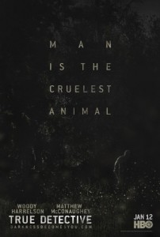
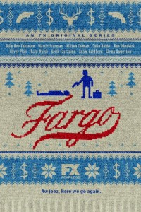

2014 yılının yavaş yavaş ortalarına doğru ilerlerken, bu yıl yayınlanmış ya da devam eden dizilerden iki tanesine ayrı bir başlık açma ihtiyacı hissettim. Daha önce [Breaking Bad](http://ahmethakanergun.com/?s=breaking+bad "breaking bad") ve [Game of Thrones](http://ahmethakanergun.com/?s=game+of+thrones "game of thrones") hakkında yazılarım olmuştu. Bu dizilerden Breaking Bad tatmin edici bir finalle geçtiğimiz yıl sona erdi. Diziyi bu yıl içerisinde tekrar en baştan izledim ve bu tamamını baştan sona ikinci kez izlediğim ilk dizi oldu. Game of Thrones ise iki güzel bölümle 4.sezona başladı ve devamını merakla bekliyoruz. Ama benim sizlere anlatmak istediğim iki dizi bunlar değil. Bu yıl 1.sezonu yayınlanan [True Detective](http://www.imdb.com/title/tt2356777/?ref_=fn_al_tt_1 "true detective") ve yeni yayına başlayan [Fargo](http://www.imdb.com/title/tt2802850/?ref_=fn_al_tt_1 "fargo dizi") sizlere aktarmak istediğim diziler. True Detective, 'iki dedektifin karşılaştıkları bir cinayete odaklanıyor ve bunun üzerinden bir seri katil takibi hikayesi anlatıyor' demek istiyorum ama sadece bu kadar değil. Dedektiflerin ikili ilişkileri, çevreleriyle yaşadıkları ve yaşamlarına yakından tanık oluyoruz. Peki nedir bu iki ortağın bize ilginç gelen yönü derseniz, onu da dizinin baş rol oyuncusu [Matthew McConaughey](http://www.imdb.com/name/nm0000190/?ref_=tt_cl_t1 "Matthew McConaughey")'in 2014 yılı En İyi Erkek Oyuncu Oscar'ına sahip olması ile özetleyebilirim. [Matthew McConaughey](http://www.imdb.com/name/nm0000190/?ref_=tt_cl_t1 "Matthew McConaughey") oynadığı filmlerdeki başarısını ve sakin oyunculuğunu True Detective'e de taşımış. Çoğunlukla komedi filmlerinde görmeye alışık olduğumuz [Woody Harrelson](http://www.imdb.com/name/nm0000437/?ref_=tt_cl_t2 "Woody Harrelson") da bu performansın yanında ezilmemiş ve aynı şahanelikle eşlik etmiş. Kısaca ben True Detective ile ilgili olarak oyunculukların ön planda olduğunu söylemeliyim. Polisiye bir hikaye olduğundan izlemeyenler için heyecanlarını kaçırmamak adına hikayeye değinmemeyi tercih ettim, fakat hiç de hafif olmadığını söylemeliyim. Fargo'ya gelecek olursak. İyi bir film izleyicisiyseniz Coen Biraderler'in 1996 yapımı [Fargo](http://www.imdb.com/title/tt0116282/?ref_=fn_al_tt_2 "fargo") filmini izlemişsinizdir ya da en azından haberdarsınızdır. Fargo, Amerika'nın kuzey kasabalarından birinde geçen ve sıradan insanların karıştığı ama sıradan olmayan bir hikayeyi anlatır. Sakin bekleyişlerin getirdiği absürt olaylar filmin temelidir. Bu yıl yayınlanmaya başlayan Fargo dizisi ise 2006 yılında geçtiği söylenen gerçek bir olaya dayanıyor ya da dayanıyormuş diyeyim. Filmde ki karakterler dizimizde yer almıyor hatta doğal olarak hikaye'de farklı fakat olayın geçtiği yer fiziken hemen hemen aynı. Karakterler ve tavırları çok benzer, ilk bölüm itibariyle de absürtlük aynı absürtlük. TV dizilerinde alışmadığımız kadar sinematografik bir dille çekilmiş ilk bölüm bize bir diziden çok daha fazlasını vadediyor. Fargo'da başrolleri son zamanlarda yıldızı gittikçe parlayan [Martin Freeman](http://www.imdb.com/name/nm0293509/?ref_=tt_cl_t3) ve tam bir karakter oyuncusu olan [Billy Bob Thornton](http://www.imdb.com/name/nm0000671/?ref_=tt_cl_t2) baylaşıyor. Bu yazıyı yazarken henüz dizinin ilk bölümü yayınlanmıştı. Gelecek bölümler için merak uyandıran ve ayakları yere basan bu ilk bölüm 2014 yılında True Detective'den sonra dizi sektörünün bize bir hediyesi görünümünde. İlerleyen bölümleri izledikçe umarım daha güzel olur ve fikrim değişmez, ben de böylelikle burada daha fazla yazı paylaşmış olurum.
