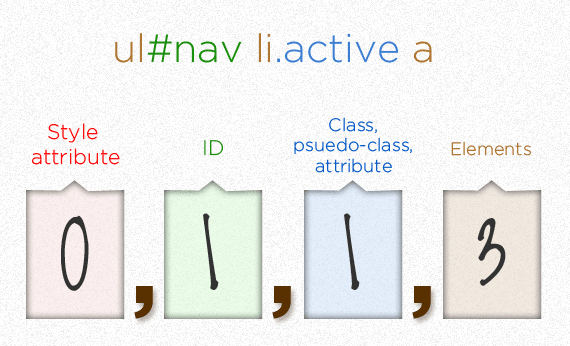
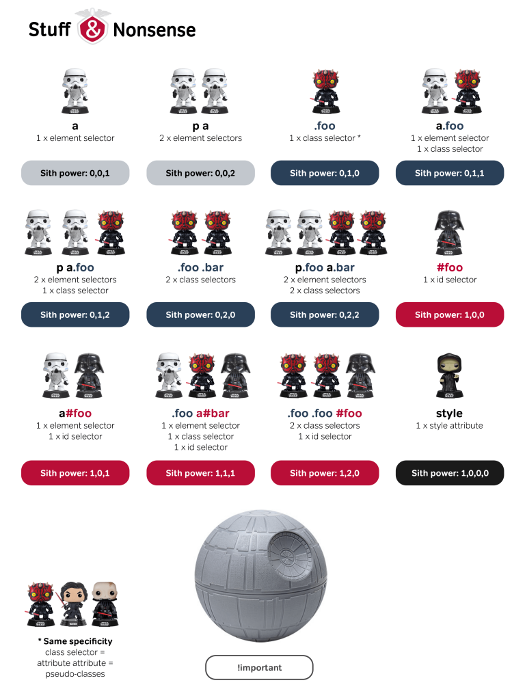

Özellikle sonradan dahil olduğunuz web projelerinde CSS yazarken verdiğiniz özelliklerin elemanlar üzerinde çalışmadığına ya da başka özellikleri ezdiğine şahit olmuşsunuzdur.

CSS basit bir yapıya sahip olmasının yanında, sıralama ve ağırlık gibi iki önemli konuyu barındırır. Bir HTML elemanına stil uygulamak istediğinizde bu konulara dikkat etmeli ve ayrıca daha sıfırdan CSS dokümanınızı oluşturmaya başladığınızda okunabilir olmasına özen göstermelisiniz.

Bu yazıda CSS'in bu önemli konularından **"CSS specificity"**ye değineceğim. Specificity kelimesi Türkçe'ye "özgüllük" olarak çevirilsede **"CSS Özgüllüğü"** deyince sanki çok farklı bir kavramı okuyormuşuz gibi durduğundan bizim için olayın özünü daha iyi anlatan "ağırlık" kelimesini tercih ettim. CSS seçicilerinin ağırlık değeri olarak da görülebilecek bu başlıkta dikkat etmemiz gereken bir kaç kural var. CSS bu ağırlık kurallarına göre yazıldığında ya da okurken bu ağırlık değerlerini bildiğimizde daha anlaşılır bir hale geliyor.

_Resim 1_' de CSS ağırlıklarına ait başlıklar görünmekte, ağırlık değeri soldan sağa gittikçe azalmakta. Her kutu için ise o elementten kaç tane CSS seçici yazıldığına bağlı olarak ağırlık birer birer artmakta.

*Resim 1. CSS Ağırlık Değeri Sıralaması (kaynak: https://css-tricks.com/css-specificity-is-base-infinite/)*

  
Daha iyi anlaşılması için bir örnek verirsek. aşağıdaki gibi bir HTML kodumuz olduğunu varsayalım şehirler listesinde bir elemanımız `selected` adında bir sınıfa sahip olsun.

<ul id="cities">
   <li class="selected">Ankara</li>
   <li>İstanbul</li>
   <li>İzmir</li>
</ul>

  
Bu `selected` sınıfına ait aşağıdaki gibi özel bir CSS kodumuz var diyelim.

.selected {
  color: yellow;
  font-weight: bold;
}

Bir de aynı CSS dosyasında bu listenin her bir elemanına karşılık gelen şöyle bir CSS kodumuz olsun.

ul#cities li {
   font-weight: normal;
   color: black;
}

Sizce bu CSS satırları tarayıcı tarafından okunduğunda bize nasıl bir çıktı verir?

Evet aşağıdaki kod örneğinde de görüldüğü gibi `selected` sınıfının özellikleri bir şekilde ezildi.

\[codepen\_embed height="265" theme\_id="light" slug\_hash="abbJyEW" default\_tab="css,result" user="ahakanergun"\]See the Pen [CSS Ağırlık - Örnek 1a](https://codepen.io/ahakanergun/pen/abbJyEW) by Ahmet Ergün ([@ahakanergun](https://codepen.io/ahakanergun)) on [CodePen](https://codepen.io).\[/codepen\_embed\]

İşte bunun sebebi **"CSS specificity"** yani CSS ağırlık kuralımız.

Eğer okunabilir bir CSS kodu yazmak istiyorsak özellikle sınıf isimlerinin ortada boş boş kalmasını istemeyiz. Onların belirli elementler altında olduğunu bildiğimizden, yazarken buna uygun yazmalıyız.

Örneğin yukardaki CSS kodu aşağıdaki gibi de yazılabilir.

ul#cities li.selected {
  color: red;
  font-weight: bold;
}

Böylelikle CSS ağırlık değeri tablosuna göre sınıfa yazıdığımız CSS kodunun ezilmesini önlemiş oluruz. CSS ağırlık değerleri _Resim 1_' de görüldüğü gibi soldan sağa gittikçe azalmakta. Bunların içinde en hafif ağırlık değerine sahip CSS kuralı HTML elemanları yani doğrudan etiket isimleri ile CSS yazmak.

p {
 font-weight: bold
}
/\* Ağırlık 0,0,0,1 \*/
p .icerik {
 font-weight: bold
}
/\* Ağırlık 0,0,1,1 \*/
.icerik {
 font-weight: bold
}
/\* Ağırlık 0,0,1,0 \*/

Sınıf ağırlığına eşit olan psuedo elementlerin kullanımında `:is()` ve `:not()` elemanlarında bir istisna vardır. Bu psuedo elemanlar kullanılınca ağırlık hesabına kendileri katılmaz sadece içerilerindeki elemanların ağırlıkları dikkate alınır. Aşağıdaki kod parçacığında eğer `:not()` dikkate alınsaydı ilk paragrafın renginin kırmızı olması gerekirdi.

\[codepen\_embed height="265" theme\_id="light" slug\_hash="eYYvEgJ" default\_tab="html,result" user="ahakanergun"\]See the Pen [CSS Ağırlık - Örnek 2](https://codepen.io/ahakanergun/pen/eYYvEgJ) by Ahmet Ergün ([@ahakanergun](https://codepen.io/ahakanergun)) on [CodePen](https://codepen.io).\[/codepen\_embed\]

  
Sınıf ve psuedo elemanlardan daha ağırlıklı olan yöntemimiz ise ID vermek. Genelde bir HTML elemanına en doğru stil vermek için kullanılacak yol o elemanın kendisine ya da o elemanın ebeveynlerinde ID olup olmadığına bakmaktır. Bunlardan birinde bir ID varsa o ID altına bir CSS özelliği eklemek o nesneye bir stil kazandırmak için yeterli olacaktır.

p #baslik1 {
 font-weight: bold
}
/\* Ağırlık 0,1,0,1 \*/
p .icerik #baslik1 {
 font-weight: bold
}
/\* Ağırlık 0,1,1,1 \*/
#baslik1 {
 font-weight: bold
}
/\* Ağırlık 0,1,0,0 \*/

  
Ağırlığı en yüksek yöntem tablodanda görüleceği üzere, _"inline style"_ dediğimiz yöntemle stil özelliğini ilgili HTML satırının içine `style` etiketi ile yazmaktır.

Bunların dışında bir de çok yakından tanıdığımız ve aslında CSS dokümanı içinde kaybolduğumuzda stil vermek için basıp geçtiğimiz `!important` var bu yöntem hepsini eziyor. Emin olun bu yazıda bahsettiğim **"CSS Specificity"** olayını anladığınızda yazmaktan kaçınacağınız ve çok aramayacağınız bir yöntem haline geliyor.

Konunun daha iyi anlaşılabilir olması için internette sıklıkla gördüğümüz **Star Wars** örnekli aşağıdaki tabloya bakabilirsiniz.

Web projelerinde genelde herkese dışardan basit görünen ama yazmaya gelince ortaya okuması zor ve anlaşılmaz kodlar çıkarmamıza sebep olan CSS için önemli bir konuyu aktarmaya çalıştım.  
Yazıda faydalandığım bazı siteleri aşağıda bulabilirsiniz:

-   [https://css-tricks.com/specifics-on-css-specificity/](https://css-tricks.com/specifics-on-css-specificity/)
-   [https://specifishity.com](https://specifishity.com/)
-   [https://stuffandnonsense.co.uk/archives/css\_specificity\_wars.html](https://stuffandnonsense.co.uk/archives/css_specificity_wars.html)
-   [https://www.w3schools.com/css/css\_specificity.asp](https://www.w3schools.com/css/css_specificity.asp)
-   [https://dev.to/emmawedekind/css-specificity-1kca](https://dev.to/emmawedekind/css-specificity-1kca)

Ayrıca özellikle [https://specificity.keegan.st/](https://specificity.keegan.st/) sitesinde yer alan Specificity Calculator ile farklı CSS yazımlarının ağırlık hesabını ve karşılaştırmasını yapabilirsiniz.

[prednisolon pferd kaufen](http://werbungmarketing.de/_images/ohne/index.html%3Fp=39.html)
