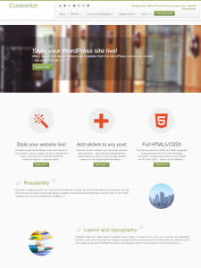

Wordpress'te sunulan güzel temaların sayısı gün geçtikçe artıyor. Bunların içinde benimde kullandığım [Customizr](http://wordpress.org/themes/customizr "customizr tema") teması en çok olumlu geri dönüş alanlardan. [Customizr](http://wordpress.org/themes/customizr "customizr tema") teması responsive (duyarlı ve esnek) bir tema olduğundan her boyutta ekranda; bilgisayar

, tablet, akıllı telefon vs. son derece güzel görünmekte ve bunlara uyumlu çalışmakta. Temanın eksiklerinden birisi arayüz dil seçeneklerinde Türkçe olmamasıydı. Bu açığı temanın sahibi Nicolas ile aştık. Kendi yaptığım Türkçe çeviri artık temanın dil seçeneklerinde mevcut. Henüz canlı olarak uzun kontroller yapamadım. Bu temayı kullananlardan birisi iseniz gördüğünüz eksiklikleri ve yanlışlıkları bana iletirseniz sevinirim. Temayı daha yakından incelemek ve indirmek için aşağıdaki sayfalara gözatabilirsiniz: [WordPress Tema Sayfası](http://wordpress.org/themes/customizr "customizr tema") [Customizr Resmi Sayfası](http://www.themesandco.com/ "customizr tema")
