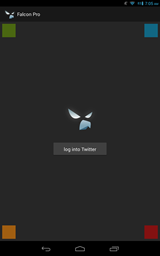
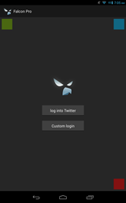
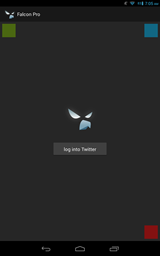

Android işletim sistemi kullanıcılarının, akıllı cihazlarında yer alan resmi [twitter](https://play.google.com/store/apps/details?id=com.twitter.android) uygulaması son derece başarılı, fakat bazı kullanıcıların ekstra isteklerinde yetersiz kalabiliyor. [Falcon Pro](http://getfalcon.pro/) üçüncü parti bir yazılım olarak twitter'dan daha fazlasını bekleyenler için iyi bir alternatif. Google Play Store'da [Plume](https://play.google.com/store/apps/details?id=com.levelup.touiteur), [Carbon](https://play.google.com/store/apps/details?id=com.dotsandlines.carbon) vs. gibi bir çok yazılım seçeneği var. Falcon Pro ise Google Play Store'da artık bulunmayan seçeneklerden. Twitter'ın API key sınırlaması yüzünden yeni indirmelere açılamayan Falcon Pro yazılımcıları çözümü yazılımı Google Play Store'dan  kaldırarak dikkat çekmekte ve uygulamanın apk dosyasını dış kaynaklardan indirmeye sunmakta görmüşler. [Falcon Pro resmi sitesinden indirilebilir.](http://getfalcon.pro/) Sitedeki linkten apk dosyasını indirip uygulamayı kurmak Falcon'u açmak için malesef yeterli değil. Sırayla aşağıdaki adımları takip etmeniz gerekiyor.   **Cihazınızda veya bilgisayarınızda;**

1.  [https://dev.twitter.com](https://dev.twitter.com/) adresini ziyaret ederek bir twitter hesabı ile giriş yapmanız gerekiyor.
2.  Profil resminizin olduğu köşeden açılan menüden "My applications" düğmesine tıklıyoruz. 
3.  "Create a new application" diyoruz.
4.  Hiç kullanılmamış benzersiz bir uygulama adı girdikten sonra bir açıklama, bir websitesi giriyoruz. Websitesinin adı hiç önemli değil formata uygun bir şeyler uydurabilirsiniz. ÖR: ([http://something.com](http://something.com/)). Callback URL kısmına da aynı URL'yi yazın.
5.  "Developer Rules Of The Road" adlı kuralların başına bir tik koyarak onaylıyoruz.
6.  "Settings" tabından Application Type olarak "Read, Write and Access direct messages," seçeneğini seçiyoruz ayrıca "Allow this application to be used to Sign in with Twitter" kısmınıda aktif ediyoruz, "Update" düğmesine tıklayarak ayarları kaydediyoruz.
7.   "Details" tabına geri dönerek "Consumer key" ve "Consumer secret." i kopyalıyoruz. Ayrıca burada bir  "Access Token"  görünmüyorsa; "generate an oauth Access Token" düğmesine de tıklıyoruz.

  **Falcon Pro Uygulamasında:**

1.  Giriş (Login) ekranını açın.
2.  Ekranda tüm köşelere teker teker tıklayın, sol alt köşedeki turuncu olan kareye tekrar tıklayarak kapatın. AŞAĞIDAKİ EKRAN GÖRÜNTÜLERİNE BAKABİLİRSİNİZ Diğer üç kare renk ekranda görünmeye devam etmeli.
3.  Telefonunuzu sallayın :) "Custom login unlocked!" ekranı görünecek.
4.  "Custom login" e tıklayın.
5.  Kopyaladığınız "Consumer Key" ve "Consumer Secret" numaralarını dikkatlice bu alanda açılan ilgili yerlere girin. Büyük küçük harf duyarlılıklarına dikkat edin.

  AŞAĞIDAKİ RESİMLERDEN EKRAN GÖRÜNTÜLERİNİ İNCELEYEBİLİRSİNİZ.             [http://www.androidpolice.com/2013/07/03/falcon-pro-updates-to-v2-0-4-outside-of-the-play-store-now-supports-a-way-to-blatantly-skirt-twitters-token-limit/](http://www.androidpolice.com/2013/07/03/falcon-pro-updates-to-v2-0-4-outside-of-the-play-store-now-supports-a-way-to-blatantly-skirt-twitters-token-limit/) adresinden aktardım.
