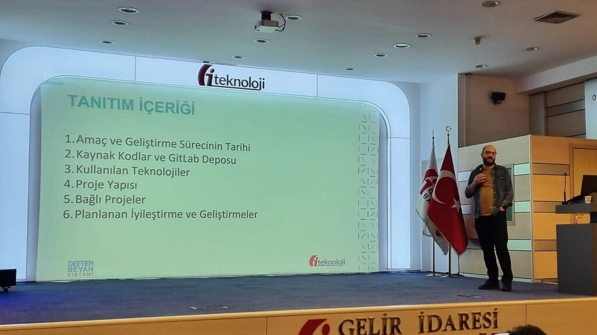

Geçtiğimiz günlerde GİB Teknoloji ailesine yeni katılan ekip arkadaşlarımıza projelerimizi anlatma fırsatı bulduk. Normalde hep sahne arkasında çalışan insanlar olarak bu kez sahne önündeydik ve hikayemizi paylaştık. Bu süreç benim için de ayrı bir heyecan ve mutluluk kaynağı oldu.

Geçmişte Defter Beyan Sistemi Projesine katkı veren herkese tekrar tekrar teşekkür etmeden geçmek olmaz. Bugün bu projeyi gururla anlatabiliyorsam, bunu bir zamanlar bu projeye emek vermiş herkese borçlum.

Bu tür aktarımlar sadece projeleri tanıtmak için değil, aslında şirketlerimizin ruhunu, iş yapış tarzını ve ekibimizin birbirine olan bağlılığını yeni ekip arkadaşlarımıza hissettirmek için de çok değerli. Yazılım dünyasında, "birlikte başarıyoruz" hissini yaşatmak bence her şeyden önemli. Bilgiyi şeffaf bir şekilde paylaşmak, her birimizin hikayeye olan katkısını fark etmesini sağlıyor.

Yeni katılan arkadaşlarımıza bu projelerin ardında ne kadar emek olduğunu ve o emeğin parçası olmanın nasıl bir gurur kaynağı yaratabileceğini anlatabilmek beni çok mutlu etti. Herkes bu yapbozun bir parçası ve o parça olmadan tam bir resim oluşturamıyoruz. Bunu hissettirmek şirket kültürümüzünün temeli.

Sonuçta, GİB Teknoloji’de hem birlikte başarıyoruz hem de bu yolda eğlenerek ilerliyoruz. Yeni ekibimizle birlikte daha birçok projeyi başarıyla tamamlayacağımıza inanıyorum.

